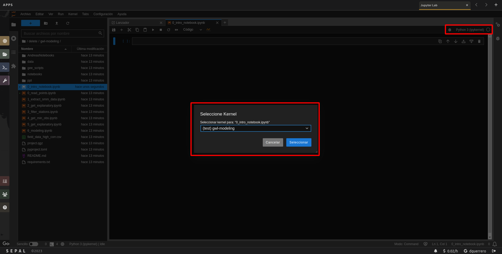

# gwl-modeling

# Initialize the project and create a virtual environment

1. clone the repository
2. create a virtual environment by using the following steps:

```bash
git clone https://github.com/dfguerrerom/gwl-modeling.git
cd gwl-modeling
python3 gee_scripts/init_venv.py
```


# Start Jupyter Notebooks and set up the kernel

1. click over the "Python 3 (ipykernel)" button
2. use the selectable dropdown menu to select the "gwl-modeling" kernel
3. click over the "Select" button

<p align="center">
  
</p>


# GEE Scripts

- biophysical variables: https://code.earthengine.google.com/6c3eeb929a5ee8a42f55234b58796c0a

# 14/02/2024
- 1_get_explanatory.ipynb changed to include extra non temporal varialbes coming from the GEE script: distance to rivers/canals, accumulation points, and direction.