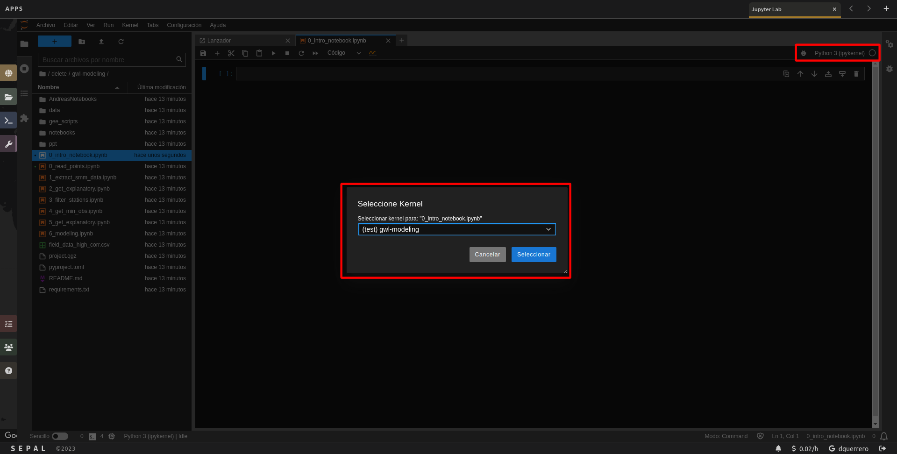

# gwl-modeling

# Initialize the project and create a virtual environment

1. clone the repository
2. create a virtual environment by using the following steps:

```bash
git clone https://github.com/dfguerrerom/gwl-modeling.git
cd gwl-modeling
python3 gee_scripts/init_venv.py
```

# Start Jupyter Notebooks and set up the kernel

1. click over the "Python 3 (ipykernel)" button
2. use the selectable dropdown menu to select the "gwl-modeling" kernel
3. click over the "Select" button

<p align="center">
  
</p>

# GEE Scripts

- biophysical variables: https://code.earthengine.google.com/6c3eeb929a5ee8a42f55234b58796c0a

# 14/02/2024

- 1_get_explanatory.ipynb changed to include extra non temporal varialbes coming from the GEE script: distance to rivers/canals, accumulation points, and direction.

# 12/06/2024

- 1_1_get_explanatory.ipynb I have modified this file to remove the -100 to 20 threshold that we have set in the past. And we will ask all the variables for those missing station/dates.

# 13/09/2024

I have updated the code to process BOSF data but I had problems to get the non temporal variables, specifically Hansan, since this dataset has changed and it now doesn't contain the yearly mean values.
The dataset that I use to use is being deprecated and now it has problems with the year 2020... either we remove those explanatory, we get them from other source or we skip 2020:

```js
Error: Asset 'UMD/hansen/global_forest_change_2020_v1_8@1641990741293807' is corrupted (Error code: 3)
```

# 17/09/2024

- We solved that problem by downloading from source the Hansen data for the year 2020 and the upload it to gee (Pablo did). Now we can use it as before.
- There were some points missing in the "all temporal variables", after inspecting the issue, it was related to the way as the script to get the temporary data works: it first gets all the dates from the points that are in a region, and then loops over the dates to get the data, we added a new "extra" mode, so it could also get images for the closest image to that date.
